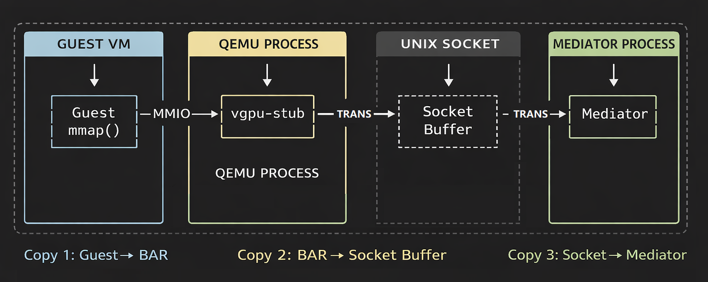
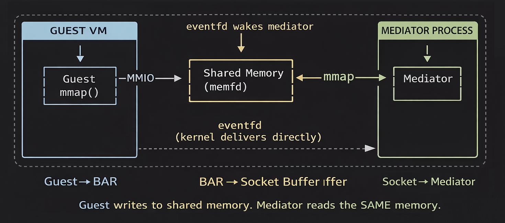

# vGPU Communication - Progress Report

**Author:** Bren  
**Date:** February 14, 2026

---

Based on the feedback about moving away from the file-based NFS transport, I spent
the last three days rebuilding the communication path between the VM and the
host-side mediator. NFS is gone. The vGPU PCI device is now the actual communication
endpoint, not just an identification register that sits in front of an NFS shortcut.

## Current Implementation

The vGPU stub device had a 4KB BAR with a handful of read-only registers (pool ID,
priority, VM ID), but requests were still going out through NFS-mounted files. I
extended the BAR layout to carry the full request/response cycle - a 1KB request
buffer, a 1KB response buffer, and control registers for doorbell, status, error
codes, and request tracking.

The guest writes its request payload into the BAR buffer, sets the length register,
and writes to the doorbell. On the host side, QEMU's MMIO handler picks up the
doorbell write, forwards the request to the mediator daemon through a Unix domain
socket, and when the result comes back, writes it into the response buffer and flips
the status register to DONE. The guest polls status and reads the result. Standard
PCI device interaction - mmap the BAR, read and write at known offsets.

The VM client was rewritten from scratch to discover the vGPU device by scanning
sysfs for the vendor/device ID, mmap the BAR0 resource, and do everything through
MMIO. No NFS client, no mount, no file polling. The mediator's scheduling and CUDA
path didn't change - same priority queue, same async dispatch. Only the input/output
side was swapped out.

I tested with two VMs running at the same time, each with its own vGPU stub device.
Both got correct results from the GPU through pure MMIO. No NFS shares mounted in
either guest.

The diagram above shows how data moves through the system right now. The guest writes
into the BAR via MMIO (copy 1), the vgpu-stub inside QEMU copies the data into a
socket message and sends it through a Unix socket (copy 2), and the mediator reads
it off the socket on the other end (copy 3). Responses go back the same way in
reverse.

| | NFS (before) | PCI/MMIO (now) |
|---|---|---|
| **Guest setup** | Mount NFS share, configure paths | Nothing - PCI device is on the bus at boot |
| **Request path** | Write file to `/mnt/vgpu/` | Write to PCI BAR registers |
| **Response path** | Poll for response file | Poll status register, read BAR buffer |
| **Host-side input** | Mediator polls a directory | Mediator gets socket events from vgpu-stub |
| **VM isolation** | Shared NFS mount | Each VM has its own PCI device |
| **Dependencies** | NFS server + client + network | None |

NFS is completely out of this path. Pool, priority, and VM ID all travel through the
PCI register space instead of being encoded in filenames. The implementation is
functional and stable - no issues with it as-is.

---

## A Possible Improvement

During the implementation I noticed that the host-side relay through QEMU (copying
data in and out of sockets on every request) can be eliminated. The BAR's data
buffers can be backed by shared memory (`memfd`) that both QEMU and the mediator map
directly, with `ioeventfd` handling the doorbell notification through the kernel
instead of trapping into QEMU. This is the same approach used by vhost-net and
vhost-user in production.

Nothing would change on the guest side - same registers, same doorbell, same status
polling. This is strictly a host-internal improvement.

| | Current (MMIO + Socket) | Shared Memory + ioeventfd |
|---|---|---|
| **Data copies per request** | 3 each way (BAR → stub → kernel → mediator) | 0 (shared pages, no copy) |
| **QEMU in data path** | Yes - copies and relays every request | No - only manages the status register |
| **Notification** | MMIO trap → QEMU handler → socket send | KVM ioeventfd → kernel delivers directly |
| **Host-side setup** | Discover each QEMU chroot, create socket inside it | One-time fd handshake at VM startup |
| **VM restart handling** | Mediator needs restart to re-discover sockets | Mediator accepts new handshake, no restart |
| **Latency** | Socket round-trip + QEMU overhead per request | eventfd signal only (microseconds) |
| **Stability** | Depends on socket file inside QEMU chroot | fd-based, no filesystem paths involved |
| **Guest-side changes** | - | None required |

This is something I can build on top of the current implementation without disrupting
what's already working. Wanted to flag it since I came across it during the build.

---

## Deliverables

| Component | Status |
|-----------|--------|
| vGPU Stub Device - extended BAR, doorbell, request/response buffers | Done |
| Mediator Daemon - socket IPC, priority queue, CUDA dispatch | Done |
| VM Client - PCI discovery, MMIO communication | Done |
| Shared Protocol Header - register map, message formats, error codes | Done |
| Build Tooling - QEMU RPM integration for XCP-ng | Done |

---
